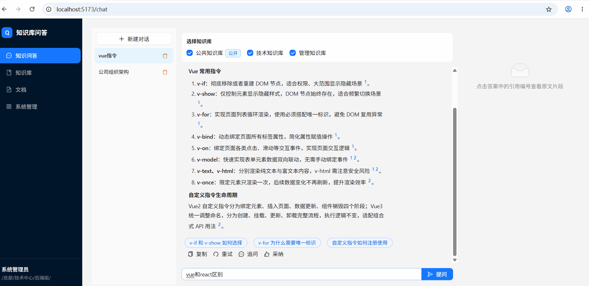
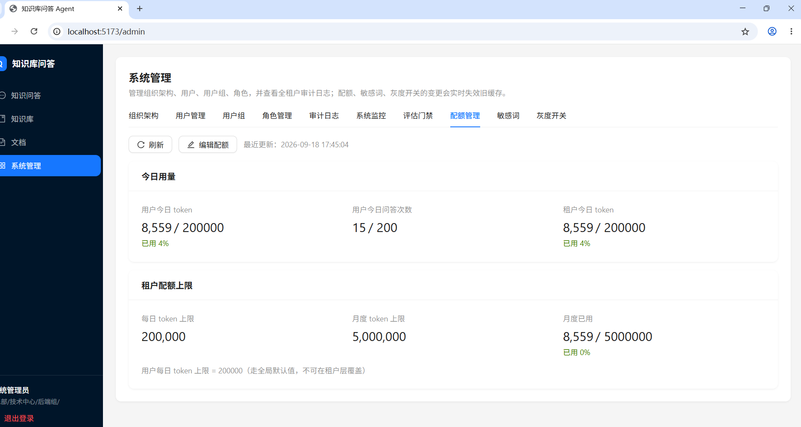

# 企业知识库问答 AI Agent

> **私有化部署的企业级 RAG 问答系统** —— 一个人，从产品方案、前端、后端到部署全链路独立完成。


上传企业文档（PDF / Word / Excel / Markdown / 纯文本）→ 自动解析、分块、向量化 → **带引用溯源的流式问答**。内置组织架构权限隔离、chunk 级密级管控、审计追溯、配额限流、敏感词拦截与灰度开关 —— 面向**数据不允许出内网**的政企私有化场景设计。

---

## 演示

| 流式问答 + 引用溯源 | 管理面板（10 个） |
|:---:|:---:|
|  |  |

- Token 级 SSE 流式输出（打字机效果），回答中的 `[1]` `[2]` 引用角标可点击回跳原文片段
- 知识库中检索不到依据时**直接拒答**，不编造（三段式 grounding 校验）

> 截图补录说明见 [code/docs/screenshots/截图清单.md](code/docs/screenshots/截图清单.md)。

---

## 30 秒看懂：这个项目做了什么

一个"RAG demo"和企业级系统的差距在**治理层**。本项目除检索问答主线外，完整实现了权限、脱敏、审计、限流、灰度五层治理：

| 能力 | 具体实现 | 代码入口 |
|------|----------|----------|
| 混合检索 | bge-m3 向量召回（1024 维）+ ILIKE 关键词双路 → RRF 融合 → bge-reranker 重排 → 0.35 相关性阈值闸门 | [services/retrieve](code/apps/api/app/services/retrieve/base.py) |
| 引用溯源 | 回答与 chunk 双向绑定，引用角标点击回跳原文 | [ChatPage.tsx](code/apps/web/src/pages/ChatPage.tsx) · [services/generate](code/apps/api/app/services/generate/) |
| 回答边界 | 检索为空 → 三段式 grounding 校验 → 拒答，严格只依据知识库作答 | [services/grounding](code/apps/api/app/services/grounding/) |
| chunk 级权限 | 四闸门判定（KB 成员 + 密级 + 拒绝标签 + 部门可见），权限过滤以 SQL WHERE **下推到检索层**，变更即时失效 Redis 缓存 | [services/acl](code/apps/api/app/services/acl/visibility.py) |
| 密级脱敏 | 4 档密级（公开/内部/机密/绝密），回答中手机号/身份证/银行卡自动打码 | [services/mask.py](code/apps/api/app/services/mask.py) |
| 限流与配额 | Redis 令牌桶（20 次/分钟）+ 用户/租户双层 token 配额 + 四级降级 | [services/quota.py](code/apps/api/app/services/quota.py) |
| 灰度开关 | 按部门 / 百分比放量，关闭即秒级回滚 | [services/feature_flag.py](code/apps/api/app/services/feature_flag.py) |
| 多轮对话 | 最近 3 轮上下文拼接 + 记忆压缩，控制 token 成本 | [services/memory.py](code/apps/api/app/services/memory.py) |

**规模**：前端 React 18 + TypeScript（问答页 + 知识库管理 + 10 个管理面板）；后端 FastAPI（21 个 REST 路由模块、7 版 Alembic 迁移）；Docker Compose 8 服务一键启动。

---

## 系统架构

### RAG 全链路

```
文档上传 → MinIO → worker(arq) 异步解析 → 分块 → bge-m3 向量化 → pgvector 入库
                                                                    │
用户提问 → 权限过滤(SQL 下推) → 向量 + 关键词双路召回 → RRF 融合     │
                        → bge-reranker 重排 → 0.35 阈值闸门 ──命中──┤
                        │                                          ▼
                      未命中                              拼 Prompt → LLM SSE 流式
                        ↓                                          ↓
                 三段式 grounding 校验                    前端 Token 级渲染 + 引用回跳
                        ↓                                          ↓
                     拒答                              密级脱敏 → 审计落库 → 配额扣减
```

### 容器拓扑

```
                    [外部 LLM API]
                         │
                    ┌────▼────┐
                    │   api   │  ── FastAPI / uvicorn
                    │  :8000  │
                    └────┬────┘
           ┌─────────────┼─────────────┐
      ┌────▼─────┐  ┌────▼────┐  ┌─────▼────┐
      │ postgres │  │  redis  │  │  minio   │
      │ pgvector │  │         │  │          │
      └──────────┘  └─────────┘  └──────────┘
           │             │
      ┌────▼─────────────▼────┐
      │     worker (arq)      │  ── 异步文档解析（失败重试 + 死信队列）
      └───────────────────────┘
           │             │
      ┌────▼─────┐  ┌────▼─────┐
      │embedding │  │ reranker │  ── bge-m3 / bge-reranker-v2-m3 本地 CPU 推理
      └──────────┘  └──────────┘

      ┌──────────┐
      │   web    │  ── React 18 + Vite → Nginx（多阶段构建）
      │  :5173   │
      └──────────┘
```

### 技术栈

| 层 | 技术 |
|----|------|
| 前端 | React 18 · TypeScript · Vite · Ant Design |
| 后端 | FastAPI · Python 3.12 · asyncpg · SQLAlchemy · Alembic |
| 数据/存储 | PostgreSQL 16 + pgvector 0.7 · Redis 7（缓存 + 令牌桶 + arq 队列）· MinIO |
| AI | bge-m3（1024 维）· bge-reranker-v2-m3（本地 CPU 推理）· OpenAI 兼容 LLM 接口 |
| 部署 | Docker Compose（开发 8 服务 / 生产 4 服务 + 2 API worker）· Nginx |

---

## 快速启动（本地 · 10 分钟）

**前提**：Docker Desktop（Windows/macOS）或 Docker + Docker Compose（Linux），内存 **16GB+**。

```bash
cd code
# 可选：编辑 .env（改 LLM API Key、管理员密码、端口）；不改也能跑
docker compose up -d --build        # 首次 10-30 分钟（下载模型 ~3GB）
docker compose logs -f api          # 看到 "Uvicorn running on ...:8000" 即完成

# 前端  http://localhost:5173
# 健康  http://localhost:8000/api/health（全绿=正常）
```

首次启动自动执行：数据库迁移（0001~0007）→ 初始化默认租户 + admin 账号 + 公开知识库 → 下载 bge-m3 / bge-reranker 到本地缓存。

| 内置账号 | 密码 | 角色 |
|------|------|------|
| admin | `ChangeMe123!` | 超级管理员（登录后请立即改密） |

**演示流程**：admin 登录 → 新建知识库 → 上传 PDF/Markdown 等到「已索引」→ 勾选知识库提问 → 右侧查看引用原文 → 切公开知识库对比权限差异。

---

## 功能清单

| 编号 | 功能 | 说明 |
|------|------|------|
| F01 | 文档上传 | PDF / md / txt / xls / xlsx / docx，单文件 ≤100MB（不支持扫描件 OCR） |
| F02 | 自动管道 | 解析 → 分块 → 向量化 → 入库，arq 异步任务 + 进度轮询 + 失败重试 + 死信队列 |
| F03 | 混合检索 | 向量相似度 + ILIKE 关键词 → RRF 融合 → bge-reranker 重排 → 0.35 阈值闸门 |
| F04 | 生成回答 | LLM SSE 流式输出，带引用溯源（点击 [n] 打开原文片段） |
| F05 | 回答边界 | 只依据检索到的知识库作答，检索为空 → 拒答（三段式 grounding check） |
| F06 | 账号登录 | RSA 加密密码 + JWT access/refresh token + Redis 黑名单 |
| F07 | 组织架构 | 部门树（物化路径）+ 用户组 + 角色 |
| F08 | 知识库成员 | 用户/部门/组/角色四种主体，支持加/删/替换 |
| F09 | chunk 级权限 | 四闸门判定（KB 成员 + 密级 + 拒绝标签 + 部门可见），检索时 SQL 下推过滤 |
| F10 | 公开知识库 | 全租户唯一，所有登录用户可见 |
| F11 | 权限缓存 | 变更 → 立即失效 Redis + 重新计算 acl_tags |
| F12 | 密级脱敏 | 4 档，回答中手机号/身份证/银行卡自动打码 |
| F13 | 审计日志 | 谁、何时、问了什么、引用了哪些文档、拒答原因，可按动作/日期过滤 |
| F14 | 多租户 | tenants 表隔离 |
| F15 | 数据同步 | 本地目录 + Git 源，定时增量 + 手动触发 |
| F16 | 多轮对话 | 会话列表 + 消息历史 + 最近 3 轮上下文 + 记忆压缩 |
| F17 | 安全加固 | 提示注入防护 + 令牌桶限流（20 次/分钟）+ 配额四级降级 + 敏感词双向拦截 + 按部门灰度开关 |

**管理面板（admin 可见，共 10 个）**：组织架构 / 用户管理 / 用户组 / 角色管理 / 审计日志 / 系统监控（P50/P95/P99 延迟 + 拒答率）/ 评估门禁（eval 用例跑可答/拒答准确率）/ 配额管理 / 敏感词 / 灰度开关。

---

## 目录结构

```
code/
├── apps/
│   ├── api/                     # 后端
│   │   ├── app/
│   │   │   ├── api/             # REST 路由层（21 个模块）
│   │   │   ├── services/        # 业务层（检索/生成/grounding/acl/配额/敏感词/特性开关…）
│   │   │   ├── models/          # SQLAlchemy ORM（PostgreSQL + pgvector）
│   │   │   ├── schemas/         # Pydantic 请求/响应模型
│   │   │   └── config/          # 配置 + 全局口径常量
│   │   ├── alembic/versions/    # 7 版数据库迁移（0001~0007）
│   │   └── tests/               # pytest 测试
│   └── web/                     # 前端
│       ├── src/pages/           # ChatPage / KnowledgeBasesPage / DocumentsPage / AdminPage
│       ├── src/pages/admin/     # 10 个管理面板
│       └── Dockerfile           # 多阶段构建：Vite → Nginx
├── docker-compose.yml           # 开发环境（8 服务）
├── docker-compose.prod.yml      # 生产环境（4 服务 + 2 API worker）
├── .env.prod.example            # 生产配置模板
└── docs/
    ├── DEPLOY.md                # 生产部署指南（F1-F5 验收 + 回滚决策树）
    └── screenshots/             # 演示截图/动图
```

---

## 工程质量：这个项目怎么被开发出来的

单人完成全栈交付的方法论 —— **用文档契约驱动 AI Coding**，而不是逐句问答式让 AI 写代码：

| 文档 | 规模 | 作用 |
|------|------|------|
| [AI-Coding-Agent-决策契约.md](AI-Coding-Agent-决策契约.md) | 24 条架构决策 | 架构层面先拍板，AI 不得自行变更 |
| [AI-Coding-Agent-实施规范.md](AI-Coding-Agent-实施规范.md) | 28 条不变量 / 40 个工作单元 | 每个工作单元有明确验收断言 |
| [企业知识库问答AI-Agent-分步开发路线.md](企业知识库问答AI-Agent-分步开发路线.md) | 分阶段路线 | 按里程碑推进，每步可验证 |

其他工程化设计：

- **数据库迁移可进可退**：7 版 Alembic 迁移，支持 downgrade
- **三层回滚体系**：灰度开关秒级回滚（零停服）→ Alembic 迁移回滚 → 镜像回滚
- **可观测性**：P50/P95/P99 延迟、拒答率监控面板 + 全链路审计
- **质量门禁**：eval 用例集自动检查可答/拒答准确率（评估门禁面板）

---

## 部署

| 场景 | 方式 | 说明 |
|------|------|------|
| 本地体验 | `docker compose up -d --build` | 见上文快速启动 |
| 同局域网演示 | 内网 IP 直访 `:5173` | 放行防火墙 5173/8000 即可 |
| 外网演示（零成本） | cpolar / ngrok 内网穿透 | 务必换 SECRET_KEY + 无余额 API Key，演示完立即停 |
| 云服务器生产 | 详见 [code/docs/DEPLOY.md](code/docs/DEPLOY.md) | 4 核 8GB 起；嵌入/重排走外部 API 可压到 4-8GB 内存 |

生产验收清单（F1-F5）、升级与回滚决策树见 [code/docs/DEPLOY.md](code/docs/DEPLOY.md)。

---

## 常见问题

<details>
<summary><b>展开 FAQ</b></summary>

**Q: 启动后 embedding/reranker 一直不健康？**
首次启动在下载模型权重（各 ~1-2GB），`docker compose logs embedding` 可看进度。网络慢设 `HF_ENDPOINT=https://hf-mirror.com`。

**Q: 启动后 pg_isready / redis 报错？**
`.env` 密码只在首次初始化生效。改密码需：停服务 → 删 `postgres_data` 卷 → 重启。

**Q: 上传文档后一直解析中？**
看 `docker compose logs worker`。失败自动重试 3 次，再失败进死信队列。常见原因：文档损坏、格式不支持、MinIO 不可达。

**Q: 提问拒答「未找到相关内容」？**
检查：知识库选对了吗 / 文档是否「已索引」/ 用户密级是否够（高密级文档低密级用户不可见）/ 问题里加文档关键词再试。

**Q: 配额/敏感词/灰度开关不起作用？**
M6 安全加固功能默认关闭，到「灰度开关」面板手动创建规则启用（`quota` / `sensitive_filter` / `rerank`）。

**Q: 想改管理员密码？**
`ADMIN_PASSWORD` 仅首次 seed 生效，后续在「用户管理」里重置。

**Q: 想临时停掉？**
`docker compose down`（不删数据），数据卷独立于容器生命周期。

</details>

---

## License

[MIT](LICENSE)
