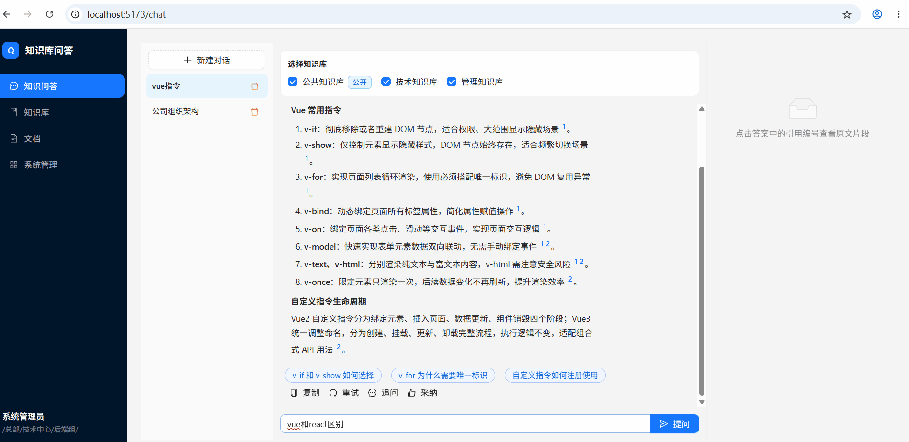
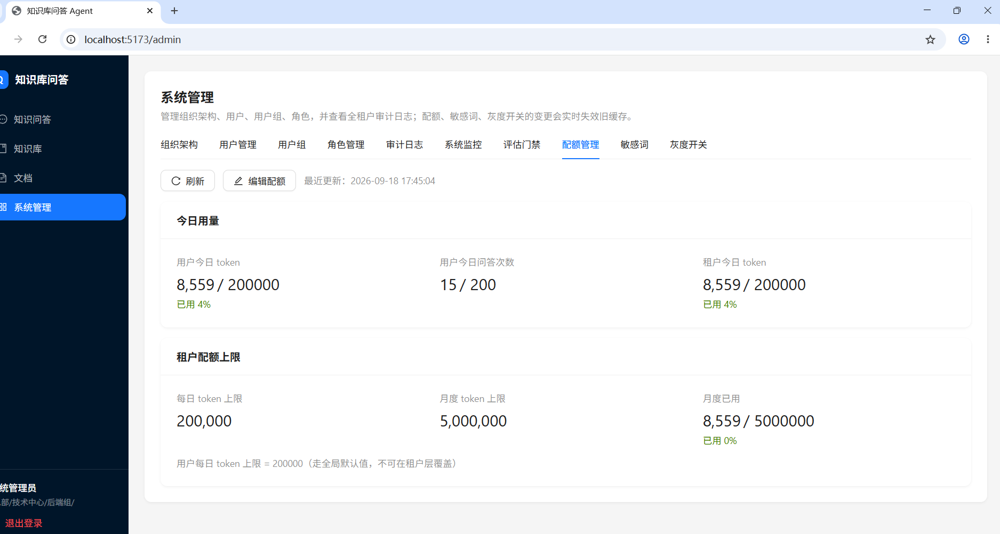

# 企业知识库问答 AI Agent

> **私有化部署的企业级 RAG 问答系统** —— 一个人，从产品方案、前端、后端到部署全链路独立完成。


上传企业文档（PDF / Word / Excel / Markdown / 纯文本）→ 自动解析、分块、向量化 → **带引用溯源的流式问答**。内置组织架构权限隔离、chunk 级密级管控、**三级记忆层**、审计追溯、配额限流、提示注入防护与灰度开关 —— 面向**数据不允许出内网**的政企私有化场景设计。

---

## 一、这个项目解决什么问题

企业内部的知识散落在 PDF、Excel、Word、Wiki 里，员工查资料靠翻盘 + 问同事；直接上通用大模型又有三个绕不过去的坎：

| 问题 | 通用大模型的短板 | 本项目的解法 |
|------|------------------|--------------|
| 数据不能出内网 | 公有云 API 直连不可接受 | 全链路私有化：Docker Compose 一键起，嵌入/重排本地 CPU 推理，LLM 可对接内网兼容接口 |
| 大模型会编造 | 无依据也给一个像样的答案 | **严格只依据知识库作答**：检索为空 → 引用双向校验 → 拒答，绝不编 |
| 答了不敢信 | 无法核实依据 | 回答与 chunk 双向绑定，引用角标 `[1]` 点击回跳原文；不脱敏的原文、脱敏的回答分开处理 |
| 文件权限复杂 | 一个"能问答"的 demo 不解决治理 | 权限、脱敏、审计、限流、灰度五层治理，权限过滤**下推到检索层**（不可见的内容根本不进模型上下文） |
| 越用越"串味" | 无记忆就每次重新说；有记忆又容易把不该记的记下来 | **三级记忆层 + 写入过滤器**：短期/长期/永久分层，长期记忆只收"偏好"、每条带来源可反查、用户可查看可删除 |

一句话：**一个 RAG demo 和企业级系统的差距在治理层。** 这个项目把治理层做完了。

---

## 二、演示

| 流式问答 + 引用溯源 | 管理面板（10 个） |
|:---:|:---:|
|  |  |

- Token 级 SSE 流式输出（打字机效果），回答中的 `[1]` `[2]` 引用角标可点击回跳原文片段
- 知识库中检索不到依据时**直接拒答**，不编造
- 断网导致流中断 → 保留已流出的文本、给出重试按钮（不是一句"请求失败"把内容清空）

> 截图与动图存放于 [code/docs/screenshots/](code/docs/screenshots/)。

---

## 三、30 秒看懂：这个项目做了什么

| 能力 | 具体实现 | 代码入口 |
|------|----------|----------|
| 混合检索 | bge-m3 向量召回（1024 维）+ tsquery 全文 + ILIKE 子串**三路** → RRF 融合 → bge-reranker 重排 → **0.50 相关性阈值闸门** | [services/retrieve](code/apps/api/app/services/retrieve/__init__.py) |
| Query 改写 | 检索前先给问题**百分制打分**（明确度 + 检索友好度 − 指代依赖），≥90 直接用原问，<90 才改写；一次 LLM 调用完成"评分→决策→改写" | [services/query_rewrite.py](code/apps/api/app/services/query_rewrite.py) |
| 引用溯源 | 回答与 chunk 双向绑定，引用角标点击回跳原文 | [ChatPage.tsx](code/apps/web/src/pages/ChatPage.tsx) · [services/generate](code/apps/api/app/services/generate/) |
| 回答边界 | 检索为空 → 拒答；有答案则走**引用双向校验**（答案→引用剥离无效行 / 引用→检索结果只留模型真用过的），严格只依据知识库作答 | [services/grounding](code/apps/api/app/services/grounding/) |
| **三级记忆层** | 短期（会话）/ 长期（用户偏好）/ 永久（系统口径）+ **写入过滤器** + 来源可反查 + 用户可查看可删除 | [services/memory.py](code/apps/api/app/services/memory.py) |
| **思维链分级** | `adaptive`：复用 Query 改写分当复杂度信号（省掉一次额外 LLM 调用），**只对难问题开启**；推理链用 `<reasoning>` 包裹，流式层剥离不外发、仅落库审计 | [services/generate](code/apps/api/app/services/generate/__init__.py) |
| 上下文治理 | 短期记忆（最近 3 轮）+ 长期画像（≤20 条事实）+ 32K 窗口预算 + 递归压缩 + 压缩超阈值提示新开对话 | [services/memory.py](code/apps/api/app/services/memory.py) |
| chunk 级权限 | 四闸门判定（KB 成员 + 密级 + 拒绝标签 + 部门可见），权限过滤以 SQL WHERE **下推到检索层**，变更即时失效 Redis 缓存 | [services/acl](code/apps/api/app/services/acl/visibility.py) |
| 提示注入防护 | 8 条规则 / 4 类模式（指令覆盖 / 角色改写 / 数据外发 / 越权诱导）检测召回片段，命中**降权不丢弃** + 指标 `rag.injection.hit` | [services/guard/injection.py](code/apps/api/app/services/guard/injection.py) |
| 密级脱敏 | 4 档密级（公开/内部/机密/绝密），回答中手机号/身份证/银行卡自动打码（引用原文不打码） | [services/mask.py](code/apps/api/app/services/mask.py) |
| 限流与配额 | Redis 令牌桶（单用户 20 次/分钟）+ 用户/租户双层 token 配额 + 四级降级 | [services/quota.py](code/apps/api/app/services/quota.py) |
| 文档预览 | 6 种格式统一转纯文本供前端预览（md/txt/docx/xlsx/xls/pdf），无文本层给明确提示 | [services/preview.py](code/apps/api/app/services/preview.py) |
| 评估门禁 | eval 用例集自动跑检索 + 生成，判定"该答的答了 / 不该答的拒了"，输出准确率报告 | [services/eval_service.py](code/apps/api/app/services/eval_service.py) |
| 微调样本闭环 | 用户采纳的问答自动落库，admin 分页查看 + 导出打标（增量取出），为后续微调备好数据资产 | [api/finetune.py](code/apps/api/app/api/finetune.py) |
| 灰度开关 | 按部门 / 百分比放量，关闭即秒级回滚 | [services/feature_flag.py](code/apps/api/app/services/feature_flag.py) |

**规模**：前端 React 18 + TypeScript（**5 个业务页面 + 10 个管理面板**）；后端 FastAPI（**20 个 REST 路由模块 / 69 个接口 / 9 版 Alembic 迁移**）；Docker Compose 8 服务一键启动。

---

## 四、RAG 全链路

```
文档上传 → MinIO → worker(arq) 异步解析 → 分块 → bge-m3 向量化 → pgvector 入库
                                                                    │
用户提问 → 敏感词拦截 → Query 打分/改写 → 权限过滤(SQL 下推) ───────┤
                                                                    │
              向量 + tsquery + ILIKE 三路召回 → RRF 融合 → 重排 → 0.50 阈值闸门
                                                                    │
                                        ┌──命中──┐            ┌──未命中──┐
                                        ▼         │            ▼
                        注入检测(降权) + 三级记忆 + token 预算裁剪   拒答
                                        │
                                        ▼
                         拼 Prompt → LLM SSE 流式 → 引用双向校验
                                        │
                                        ▼
                     前端 Token 级渲染 + 引用回跳 → 密级脱敏 → 审计落库 → 配额扣减
```

### 三级记忆层

| 层级 | 定义 | 落点 | 收什么 / 不收什么 |
|------|------|------|-------------------|
| **短期** | 单次会话内有效 | `Message` 表（按 `conversation_id` 读，单次上限 500 行），会话内按 token 预算压缩 | 多轮对话历史；**不落 Redis** —— 换设备/刷新后上下文仍在 |
| **长期** | 跨会话、按用户持久 | `users.memory` JSONB（`{profile, facts}`） | **只收 `kind=preference`**（身份、偏好、技术栈）；检索到的文档片段禁入 |
| **永久** | 系统级行为定义 | 口径版本表 | 阈值 / 提示词 / Schema / 分块口径，**只追加不修改** |

**为什么短期记忆不落 Redis（刻意选择，不是遗漏）**：Redis 无持久化会丢两件事 —— **多端同步**（A 设备问了一半，B 设备打开没有上下文）与**刷新恢复**（刷新页面历史消失）。所以"短"体现在**压缩与裁剪**，不是存储介质的易失性。

### 上下文治理的四个口径

（都在 [config/decisions.py](code/apps/api/app/config/decisions.py) 里冻结、可被单测 monkeypatch 锁死）

| 口径 | 值 | 为什么 |
|------|-----|--------|
| 短期记忆 | 最近 6 条（3 轮） | 再往后对当前轮的价值衰减很快，占的却是最贵的 prompt 预算 |
| 长期记忆 | 只收 `preference` / ≤20 条事实 / ≤800 字符 | 只留跨对话稳定的信息，"好的""让我看看"这类不进画像 |
| 单请求窗口 | **32K token**（预留 4K 输出） | 超限则**递归压缩** history（逐轮减少保留轮数）+ 裁剪 chunks 直到达标 |
| 历史读取上限 | DB 单次 500 行硬上限 | DB 层只做保护，不做业务裁剪；改写 32K、压缩、生成各自按自己的 token budget 裁 |

同一会话被压缩超过 **3 次**，后端通过 SSE `context_warning` 事件提示用户"新开对话重置上下文"—— 与其让模型在一条被压扁的历史上下文中越答越糊，不如把选择权交给用户且说清楚原因。

### 记忆写入的四道关

写入长期记忆不是"把对话存下来"，而是**提炼 → 过滤 → 门槛 → 留痕**：

1. **提炼**：会话结束时由 LLM 抽取结构化事实，不是复制 transcript
2. **过滤**：11 条 `BLOCKED_MEMORY_PATTERNS`（引用痕迹、拒答文案、密级标识、内部字段名、过短/过长…）
3. **门槛**：置信度 < 0.6 不入库，单条 4~60 字（用长度粗粒度区分"偏好"与"片段"，无需额外 LLM 调用）
4. **留痕**：每条 MUST 带 `source_trace_id` —— 这是权限变更时**按文档反查清除的唯一依据**

**读取侧**走白名单：只召回 `kind=preference` 且 `scope=user` 的项，且 prompt 必须从 `facts` 重建（**不读 `profile` 快照** —— 快照无法按 `kind` 过滤，直接用它白名单就形同虚设）。

---

## 五、四个设计取舍

**1. 为什么关键词召回要做到三路（向量 + tsquery + ILIKE），而不是单路向量？**

纯向量召回在专业术语、编号、人名上会漏（"F09"和"F10"在向量空间几乎重合）。关键词路分两条是有原因的：`tsquery`（走 `idx_chunk_fts` 索引）负责**英文/数字词元**的精确匹配，但 PostgreSQL 的 `simple` 配置**不做中文分词**；中文只能靠 `ILIKE` 子串匹配兜底。两者都不完美，但**漏的地方不一样**，叠加才拿得回大部分本该命中的片段。

三路之后用 **RRF 融合**：RRF 只看**排名**不看分数，天然规避了多路分数量纲不可比的问题（向量相似度 0~1、`ILIKE` 是布尔、`tsquery` 是 rank），也不需要为每一路调权重参数。融合后再走 bge-reranker 精排 —— 召回要宽（`TOP_K_RECALL=50`），重排要准（`TOP_K_RERANK=8`）。

**2. 为什么权限过滤要下推到检索层 SQL，而不是检索后再过滤？**

检索后过滤有两个致命问题：一是**数据已经进了上下文**，模型可能在回答里"顺嘴"说出来（越权泄露）；二是过滤后可能只剩 1~2 条，甚至 0 条但系统仍以为检索命中了。所以四个闸门写成 SQL `WHERE` 的一部分，让不可见的内容**从未进入候选集**。代价是权限变更要立即失效 Redis 缓存（`acl_tags` 重算）—— 这个代价是必须付的，缓存的 5 分钟不一致在权限场景是不可接受的。

**3. 为什么 Query 改写只用于检索、不用于生成？**

改写是"为了检索更好命中"做的扩写（补全指代、口语转术语），它**不是**用户的原话。如果拿改写后的 query 去生成，等于让模型回答一个用户没问的问题 —— 所以改写结果只喂 retrieval（HyDE 模式），generation 始终使用原始 question。同理，打分刻意用**一次** LLM 调用完成"评分 + 决策 + 可选改写"，省掉一次调用的首字延迟；超时 5s 或 JSON 解析失败就静默回退原问题，绝不因为一个优化项把主链路拖死。

**4. 为什么长期记忆只记"用户偏好"，不记"检索到的内容"？**

因为**权限是实时的，画像副本不是**。如果把会话里检索到的文档片段沉淀进用户画像，就出现这样一条时间线：

```
今天：用户有权看 A 文档  → 检索到 → 提炼进画像
明天：权限被收回         → 检索层的四闸门立刻拦住
                          但画像里那份副本还在 → 等于绕过了守卫
```

这是企业知识库最真实的风险点，所以长期记忆做了双向防护：**写入过滤器** + **读取白名单**。两者是**双保险而非重复** —— 模型换个说法可以绕过正则，但绕不过 `kind` 字段；任一侧失守，另一侧仍能挡住。

配套的合规能力是**用户可查看、可删除自己被记了什么**（`GET /api/me/memory` 等三个端点，**物理删除**而非标记删除 —— 标记删除的副本仍在 JSONB 里，等于没删），且这三个端点**不接受 `user_id` 参数**，从接口形态上就排除掉"查看/删除他人画像"。

---

## 六、容器拓扑

```
                    [外部 LLM API]
                         │
                    ┌────▼────┐
                    │   api   │  ── FastAPI / uvicorn
                    │  :8000  │
                    └────┬────┘
           ┌─────────────┼─────────────┐
      ┌────▼─────┐  ┌────▼────┐  ┌─────▼────┐
      │ postgres │  │  redis  │  │  minio   │
      │ pgvector │  │         │  │          │
      └──────────┘  └─────────┘  └──────────┘
           │             │
      ┌────▼─────────────▼────┐
      │     worker (arq)      │  ── 异步文档解析（失败重试 + 死信队列）
      └───────────────────────┘
           │             │
      ┌────▼─────┐  ┌────▼─────┐
      │embedding │  │ reranker │  ── bge-m3 / bge-reranker-v2-m3 本地 CPU 推理
      └──────────┘  └──────────┘

      ┌──────────┐
      │   web    │  ── React 18 + Vite → Nginx（多阶段构建）
      │  :5173   │
      └──────────┘
```

### 技术栈

| 层 | 技术 |
|----|------|
| 前端 | React 18 · TypeScript · Vite · Ant Design |
| 后端 | FastAPI · Python 3.12 · asyncpg · SQLAlchemy · Alembic |
| 数据/存储 | PostgreSQL 16 + pgvector 0.7 · Redis 7（缓存 + 令牌桶 + arq 队列）· MinIO |
| AI | bge-m3（1024 维）· bge-reranker-v2-m3（本地 CPU 推理）· OpenAI 兼容 LLM 接口（默认 deepseek-v4-flash） |
| 部署 | Docker Compose（开发/生产各 8 服务，生产 `api` 起 2 个 uvicorn worker 进程）· Nginx |

---

## 七、快速启动（本地 · 10 分钟）

**前提**：Docker Desktop（Windows/macOS）或 Docker + Docker Compose（Linux），内存 **16GB+**。

```bash
cd code
# 可选：编辑 .env（改 LLM API Key、管理员密码、端口）；不改也能跑
docker compose up -d --build        # 首次 10-30 分钟（下载模型 ~3GB）
docker compose logs -f api          # 看到 "Uvicorn running on ...:8000" 即完成

# 前端  http://localhost:5173
# 健康  http://localhost:8000/api/health（全绿=正常）
```

首次启动自动执行：数据库迁移（0001~0009）→ 初始化默认租户 + admin 账号 + 公开知识库 → 下载 bge-m3 / bge-reranker 到本地缓存。

| 内置账号 | 密码 | 角色 |
|------|------|------|
| admin | `ChangeMe123!` | 超级管理员（登录后请立即改密） |

**演示流程**：admin 登录 → 新建知识库 → 上传 PDF/Markdown 等到「已索引」→ 勾选知识库提问 → 右侧查看引用原文 → 切公开知识库对比权限差异。

---

## 八、功能清单

| 编号 | 功能 | 说明 |
|------|------|------|
| F01 | 文档上传 | PDF / md / txt / xls / xlsx / docx，单文件 ≤100MB（不支持扫描件 OCR，明确拒绝而非静默失败） |
| F02 | 自动管道 | 解析 → 分块 → 向量化 → 入库，arq 异步任务 + 进度轮询 + 失败重试 + 死信队列；PDF 表格经 pdfplumber 识别结构，切分后每块保留表头 |
| F03 | **混合检索** | 向量 + tsquery + ILIKE 三路召回 → RRF 融合 → bge-reranker 重排 → 0.50 阈值闸门 |
| F04 | Query 改写 | 百分制打分（≥90 跳过），改写结果仅用于检索；5s 超时静默回退，不阻塞主链路 |
| F05 | 生成回答 | LLM SSE 流式输出，事件序列 `meta → stage → [refused \| citations → delta… → done]` |
| F06 | 回答边界 | 只依据检索到的知识库作答，检索为空 → 拒答；**引用双向校验**（答案→引用剥离 / 引用→检索去幻） |
| F07 | **上下文治理** | 短期 3 轮 + 长期画像（≤20 条）+ 32K 预算 + 递归压缩 + 压缩 ≥3 次 SSE 提示新开对话 |
| F08 | 账号登录 | Web Crypto RSA-OAEP 前端加密密码 + JWT access/refresh token + Redis 黑名单 |
| F09 | 组织架构 | 部门树（物化路径）+ 用户组 + 角色 |
| F10 | 知识库成员 | 用户/部门/组/角色四种主体，支持加/删/替换 |
| F11 | chunk 级权限 | 四闸门判定（KB 成员 + 密级 + 拒绝标签 + 部门可见），检索时 SQL 下推过滤 |
| F12 | 公开知识库 | 全租户唯一，所有登录用户可见 |
| F13 | 权限缓存 | 变更 → 立即失效 Redis + 重新计算 acl_tags |
| F14 | 密级脱敏 | 4 档，回答中手机号/身份证/银行卡自动打码（citations.snippet 不打码） |
| F15 | 审计日志 | 谁、何时、问了什么、引用了哪些文档、拒答原因，可按动作/日期过滤 |
| F16 | 多租户 | tenants 表隔离（私有化交付默认单租户） |
| F17 | 数据同步 | 本地目录 + Git 源，定时增量 + 手动触发 |
| F18 | 多轮对话 | 会话列表 + 消息历史 + 上下文压缩 |
| F19 | 文档预览 | `GET /documents/{id}/raw`，6 种格式统一转纯文本；不支持格式返回 415 |
| F20 | 评估门禁 | eval 用例集自动跑检索 + 生成，检查可答/拒答准确率，出报告 |
| F21 | 微调样本闭环 | 采纳问答落库 → admin 查看 → 导出打标（增量取出） |
| F22 | 安全加固 | 提示注入检测（8 规则/4 类，命中降权）+ 令牌桶限流（20 次/分钟）+ 配额四级降级 + 敏感词双向拦截 + 按部门灰度开关 |
| F23 | 前端体验 | 上传进度、批量删除、列表分页、SSE 断网提示与一键重试（保留已流出文本） |
| F24 | **三级记忆层** | 短期/长期/永久分层契约 + 11 条写入过滤器 + 来源 trace 反查清除 + 用户可查看/可删除（物理删除） |
| F25 | **思维链分级** | `COT_MODE`（off/adaptive/full）；adaptive 复用 Query 改写分判断复杂度，仅对难问题开启；推理链不外发、仅落库审计 |

**管理面板（admin 可见，共 10 个）**：组织架构 / 用户管理 / 用户组 / 角色管理 / 审计日志 / 系统监控（P50/P95/P99 延迟 + 拒答率）/ 评估门禁 / 配额管理 / 敏感词 / 灰度开关。

---

## 九、目录结构

```
code/
├── apps/
│   ├── api/                     # 后端
│   │   ├── app/
│   │   │   ├── api/             # REST 路由层（20 个模块 / 69 个接口）
│   │   │   ├── services/        # 业务层（检索/改写/生成/grounding/acl/记忆/注入防护/评估/预览…）
│   │   │   │   ├── retrieve/    #   三路召回 + RRF 融合
│   │   │   │   ├── guard/       #   提示注入检测
│   │   │   │   ├── parse/       #   6 种格式解析器（PDF 表格走 pdfplumber）
│   │   │   │   └── chunk/       #   分块（粒度优先级 + 表格整表/按行组带表头）
│   │   │   ├── models/          # SQLAlchemy ORM（PostgreSQL + pgvector）
│   │   │   ├── schemas/         # Pydantic 请求/响应模型
│   │   │   ├── infra/           # 指标 / 链路 / Redis 与 arq 连接池
│   │   │   └── config/          # 配置 + 全局口径常量（decisions.py + 启动自检）
│   │   ├── alembic/versions/    # 9 版数据库迁移（0001~0009）
│   │   └── tests/               # pytest（ACL 判定 / 检索 / 分块 / 记忆 / 注入 / 解析…）
│   └── web/                     # 前端
│       ├── src/pages/           # ChatPage / KnowledgeBasesPage / DocumentsPage / AdminPage
│       ├── src/pages/admin/     # 10 个管理面板
│       └── Dockerfile           # 多阶段构建：Vite → Nginx
├── docker-compose.yml           # 开发环境（8 服务）
├── docker-compose.prod.yml      # 生产环境（8 服务，api 起 2 worker）
├── .env.prod.example            # 生产配置模板
└── docs/
    ├── DEPLOY.md                # 生产部署指南（F1-F5 验收 + 回滚决策树）
    └── screenshots/             # 演示截图/动图
```

---

## 九之二、PDF 表格为什么单独处理

企业文档里最关键的信息常在表格里（参数表、对照表、统计表），而**纯文本抽取会把表格拍平**：

```
资源 Spec Qty Note              ← 有边框 / 无边框 / 11 列宽表，pypdf 输出完全相同
嵌入模型 bge-m3 1 本地推理      ← 行与列的对应关系丢失
```

后果不是"读起来别扭"，而是**检索侧答错**：用户问「重排延迟是多少」，向量命中的是 `Reranker bge-reranker-v2-m3 1 local inference` 这样一坨——模型无法知道哪一列是延迟。

处理分两处，缺一不可：

| 环节 | 做法 | 不做会怎样 |
|---|---|---|
| 解析层 | `pdfplumber` 识别表格，产出 `is_table` + `table_header`，单元格用 TSV 保留列边界 | `is_table`恒为 false，表格当普通文本切 |
| 分块层 | 超 `CHUNK_MAX_TOKENS` 时按行组切，**每个子块前置表头行** | 切开后 4 个块里 3 个丢表头，后面那些块单独 embedding 时不知道列的含义 |

两个容易踩的细节：

- **同一份数据不能入块两次**。表格区域的内容已经进了表格块，若同页正文里再留一份，就会被 embedding 两次，且两块向量不同构（一个 TSV 结构化、一个拍平字符流）。做法是用词的坐标把表格区域从正文里排除。
- **扫描件判定必须优先于表格识别**。扫描件既没有文本层也没有可靠表格线，顺序反了会把版面噪声（边框、分栏线）当成表格，让「明确拒绝扫描件」这条契约失效。

实测：4 列 × 60 行表格 → 4 个 chunk，**每个都带表头**，无超限，数据行零丢失。

> 表格切分这里还有个曾经的**死循环**：当「表头 + 一行数据」本身就超过 token 上限时，累积器装不下任何单元 → 清空重叠重来 → 还是装不下 → 索引永不推进，整个 worker 静默挂死。已修复并用单测钉住（见 `tests/parse/test_pdf_parser.py`）。

---

## 十、工程质量：这个项目怎么被开发出来的

单人完成全栈交付的方法论 —— **用文档契约驱动 AI Coding**，而不是逐句问答式让 AI 写代码：

| 文档 | 规模 | 作用 |
|------|------|------|
| [AI-Coding-Agent-决策契约.md](AI-Coding-Agent-决策契约.md) | 24 条架构决策 | 架构层面先拍板，AI 不得自行变更 |
| [AI-Coding-Agent-实施规范.md](AI-Coding-Agent-实施规范.md) | 28 条不变量 / 40 个工作单元 | 每个工作单元有明确验收断言 |
| [企业知识库问答AI-Agent-分步开发路线.md](企业知识库问答AI-Agent-分步开发路线.md) | 分阶段路线 | 按里程碑推进，每步可验证 |

**口径即代码，违规拒绝启动**：所有关键口径（阈值、密级、可见性、分块、配额、压缩）落在 `config/decisions.py`，应用启动时跑 `self_check()`，任何一条被改坏就抛异常**拒绝启动**（fail-closed）。例如把"文档标签可以展开祖先"改成 True，服务直接起不来 —— 因为那等于让全公司文档互通。业务代码必须通过 `decisions.X` 读常量，单测可以用 monkeypatch 把口径锁死。

其他工程化设计：

- **数据库迁移可进可退**：9 版 Alembic 迁移，支持 downgrade
- **三层回滚体系**：灰度开关秒级回滚（零停服）→ Alembic 迁移回滚 → 镜像回滚
- **可观测性**：P50/P95/P99 延迟、拒答率监控面板 + 全链路审计 + 注入命中/记忆契约违反等细粒度计数器
- **资源复用**：Redis 与 arq 连接池**进程级共享**（请求级调用点拿到的 `aclose()` 是 no-op）—— 高并发下不会每请求新建/关闭连接
- **质量门禁**：eval 用例集自动检查可答/拒答准确率；pytest **218 个用例（17 个测试文件）**覆盖 ACL 判定 / RRF 融合 / 阈值闸门 / 分块 / 记忆过滤 / 注入检测 / 解析 / CoT / Query 改写等核心链路；关键口径被改坏则启动自检拒绝启动（fail-closed）

### 上线前自检发现的真实缺陷（已修复）

这些都是我在**交付前的自检/复查批次**里自己找出来并修掉的，不是线上事故记录：

| 级别 | 问题 | 修复方式 |
|------|------|----------|
| P1 | **越权**：部分详情类接口只做了登录校验，没复用检索链路的权限口径 | 统一 admin 鉴权口径，把权限校验收敛到数据访问层，而不是逐个接口打补丁 |
| P1 | `trigger_sync` 用了未导入的 `Request` / `get_settings` —— 该端点一调用就 500（`from __future__ import annotations` 让注解不求值，所以 import 阶段与编译检查都不报错） | 补齐导入；由静态检查的 `undefined name` 抓出 |
| P2 | 前端鉴权链路可绕过（路由守卫、admin 面板入口） | 前端守卫 + 后端二次校验，前后端同口径 |
| P2 | token rotation 竞态：并发刷新时旧 token 被误判有效 | 刷新链路加原子操作，消除竞态窗口 |
| P2 | logout 死锁 | 拆掉锁内 await，改造清理时序 |
| P2 | 高并发隐患：Redis 客户端与 arq 池**逐请求新建/关闭** | 改为进程级共享连接池（32 处调用点 + 后台任务模块） |
| P3 | 硬编码密钥、CORS 过宽、连接池参数不合理 | 全部外置到环境变量，收紧默认值 |
| P3 | 审计日志 LIKE 转义、时间边界、embedding 条数校验 | 逐项补齐边界处理 |

---

## 十一、已知边界（明确说清不做什么）

说清"不做什么"与说清"做了什么"同样重要 —— 边界越清楚，可信度越高。

| 边界 | 说明 | 如果要做会怎么改 |
|------|------|------------------|
| 不支持扫描件 OCR | 无文本层的 PDF 在解析层显式拒绝并提示，**不静默失败** | 接入 PaddleOCR / 云 OCR，作为独立的解析分支，配额与耗时单独计 |
| 多租户默认关闭 | 私有化交付 = 单租户；SaaS 场景置 `MULTI_TENANT_ENABLED=True`，但 `tenant_id` 过滤始终存在 | 补租户级资源隔离与计费 |
| 嵌入/重排本地 CPU 推理 | 换来"数据不出内网"，代价是单机吞吐有限 | 生产可切外部 API 或加 GPU 节点，接口层已抽象 |
| 部署形态为 Docker Compose 单机 | 未上 K8s | 组件已无本地状态依赖（数据全在 PG/Redis/MinIO），具备容器化上 K8s 的前提 |
| 未做真实微调训练 | 只完成了**样本收集与导出链路**，为微调准备数据资产 | 拿到足够采纳样本后做 LoRA，定位是"改行为"而非"塞知识"（知识仍走 RAG） |
| 中文关键词召回靠 ILIKE | PostgreSQL `simple` 配置不做中文分词，中文子串匹配没有索引加速 | 接 `pg_search` / `ParadeDB`（BM25）或独立检索引擎做中文分词 |
| 记忆写入过滤是启发式的 | 正则能挡住大部分片段泄漏，但挡不住"换个说法的绕过" | 已用 `kind` 字段做读取侧白名单兜底；后续可加小模型做写入侧分类 |

---

## 十二、部署

| 场景 | 方式 | 说明 |
|------|------|------|
| 本地体验 | `docker compose up -d --build` | 见上文快速启动 |
| 同局域网演示 | 内网 IP 直访 `:5173` | 放行防火墙 5173/8000 即可 |
| 外网演示（零成本） | cpolar / ngrok 内网穿透 | 务必换 SECRET_KEY + 无余额 API Key，演示完立即停 |
| 云服务器生产 | 详见 [code/docs/DEPLOY.md](code/docs/DEPLOY.md) | 4 核 8GB 起；嵌入/重排走外部 API 可压到 4-8GB 内存 |

生产验收清单（F1-F5）、升级与回滚决策树见 [code/docs/DEPLOY.md](code/docs/DEPLOY.md)。

---

## 十三、常见问题

<details>
<summary><b>展开 FAQ</b></summary>

**Q: 启动后 embedding/reranker 一直不健康？**
首次启动在下载模型权重（各 ~1-2GB），`docker compose logs embedding` 可看进度。网络慢设 `HF_ENDPOINT=https://hf-mirror.com`。

**Q: 启动后 pg_isready / redis 报错？**
`.env` 密码只在首次初始化生效。改密码需：停服务 → 删 `postgres_data` 卷 → 重启。

**Q: 上传文档后一直解析中？**
看 `docker compose logs worker`。失败自动重试 3 次，再失败进死信队列。常见原因：文档损坏、格式不支持、MinIO 不可达。

**Q: 提问拒答「未找到相关内容」？**
检查：知识库选对了吗 / 文档是否「已索引」/ 用户密级是否够（高密级文档低密级用户不可见）/ 问题里加文档关键词再试。

**Q: 为什么回答不到我的问题，改写是关掉了吗？**
改写默认开启（`QUERY_REWRITE_ENABLED`）。改写只在打分 <90 时触发，且只影响检索。如果检索仍为空，是知识库确实没有依据 —— 这是设计上的拒答，不是故障。

**Q: 提示"上下文已被压缩 N 次，建议新开对话"？**
同一会话内历史被压缩超过 3 次（`COMPRESSION_WARN_THRESHOLD`）。继续问下去模型能看到的历史会越来越稀薄，新开会话上下文重置、回答质量更好。这是提示不是报错。

**Q: 我的提问会被记住吗？能删掉吗？**
长期记忆**只记你的偏好类信息**（不是你的提问内容，也不是检索到的文档片段）。可以在「我的」相关接口查看和删除：`GET /api/me/memory`、`DELETE /api/me/memory/items/{memory_id}`、`DELETE /api/me/memory`。删除是**物理删除**。

**Q: 配额/敏感词/灰度开关不起作用？**
M6 安全加固功能默认关闭，到「灰度开关」面板手动创建规则启用（`quota` / `sensitive_filter` / `rerank`）。

**Q: 想改管理员密码？**
`ADMIN_PASSWORD` 仅首次 seed 生效，后续在「用户管理」里重置。

**Q: 想临时停掉？**
`docker compose down`（不删数据），数据卷独立于容器生命周期。

</details>

---

## License

[MIT](LICENSE)
